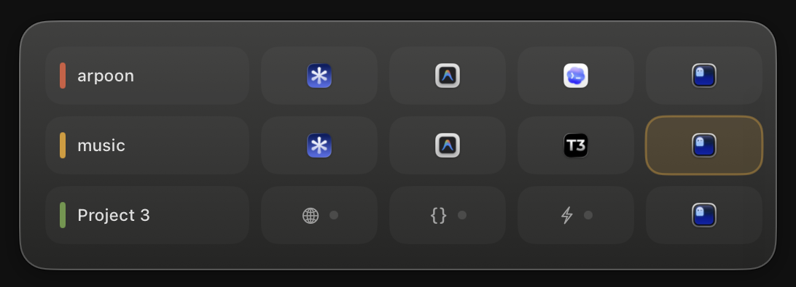
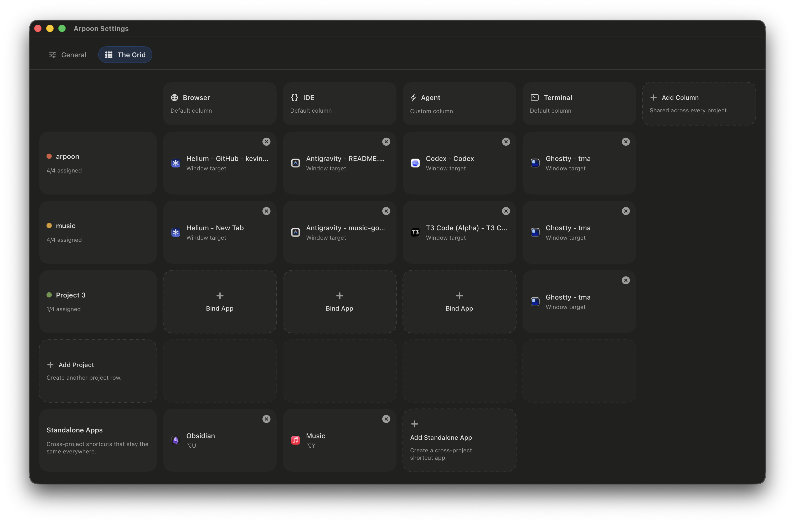

# Arpoon for macOS

I built this after Theo’s streams and [writeup](https://x.com/theo/status/2018091358251372601) on the multi-project, parallel-work problem.

He described something I had already been feeling: the problem is not really layout anymore. It is focus. One project lives across a terminal, editor, and browser. Do that for a few projects at once and you spend too much time just getting back to the right thing.

Arpoon obviously does not solve that whole problem. It is just my quick take on one part of it: focusing the right app or window fast.

I had already tried Amethyst, yabai, AeroSpace, and on Linux, i3 and Hyprland. Great tools. Just not really my problem. I did not want tiling. I wanted faster recall.

The first versions of Arpoon were basically my macOS take on Prime's [Harpoon](https://github.com/ThePrimeagen/harpoon): static slots and dynamic bindings for keeping a small working set close and jumping back to it quickly.

Those modes are still in the app, and I still like them. But they were earlier attempts at the same problem.

The grid came next. It borrows the spatial idea from niri and applies it to project focus management on macOS.

It does not move windows around. It only changes focus. Most of my windows are maximized anyway, so I do not really want a layout engine. I just want to get back to the right thing quickly.

- rows are projects
- columns are tools
- up and down switches project focus
- left and right switches tool focus
- a small HUD shows where I am

So instead of a flat list of bindings, it becomes more like a project map.

Arpoon obviously does not solve this whole problem. It is just my quick take on one part of it: focusing the right app or window fast.

<video src="https://github.com/user-attachments/assets/f2f13d9b-3c62-4b8a-a652-3ff2bc6eed1a"></video>


## What it is

A small native macOS utility for getting back to the right app or window quickly.

It is not a window manager.
It does not tile or arrange windows.
It just helps me move through parallel project work with less friction.

## Features

### Grid mode

The newer navigation model.

- bind windows into project rows and tool columns
- switch between projects
- switch between tools inside a project
- see a small HUD while navigating




### Dynamic mode

One of the earlier ideas, inspired by Harpoon.

- **Add dynamic hotkey:** `Alt + A`

### Static mode

Also inspired by Harpoon.

- **Bind to slot 1-9:** `Cmd + Shift + 1-9`
- **Jump to slot 1-9:** `Cmd + 1-9`

### Directional focus

I added this because I did not want another app for something simple.

- **Focus app left:** `Alt + H`
- **Focus app right:** `Alt + L`
- **Focus app up:** `Alt + K`
- **Focus app down:** `Alt + J`

## Install

Arpoon is currently unsigned and not notarized.

### Download

Download `Arpoon-macOS.zip` from the latest GitHub Release and unzip it.

On first launch, macOS will probably warn that it cannot verify the app. To open it:

1. Right-click `Arpoon.app` and choose **Open**
2. Click **Open** again
3. If needed, allow it in **System Settings > Privacy & Security**

### Build locally

```bash
./scripts/install-dev.sh
````

If you add new source files, regenerate the Xcode project first:

```bash
xcodegen generate
```

To build the release zip:

```bash
./scripts/package-release.sh
```
